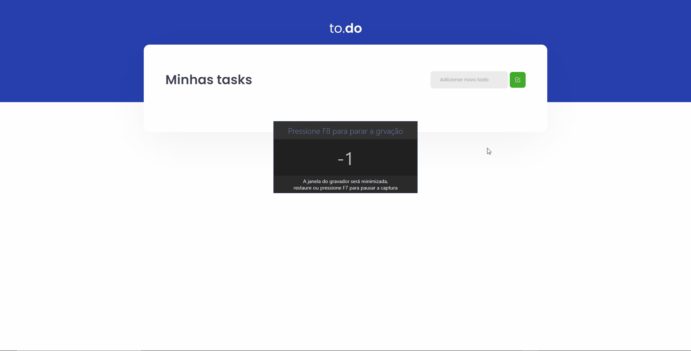

# Rocketseat Ignite (ReactJS) - To-do List solution

This is a solution to the to-do list challenge of Rocketseat Ignite
### ⚔️ The challenge

Users should be able to:

- Create a new task
- Remove a task
- Mark and unmark a task as complete

## 👀 Preview

### 🔨 Built with

- <strong>ReactJS</strong>
- <strong>Typescript</strong>
- Semantic <strong>HTML5</strong> markup
- <strong>CSS</strong> custom properties
- Flexbox
- <strong>Sass</strong>
